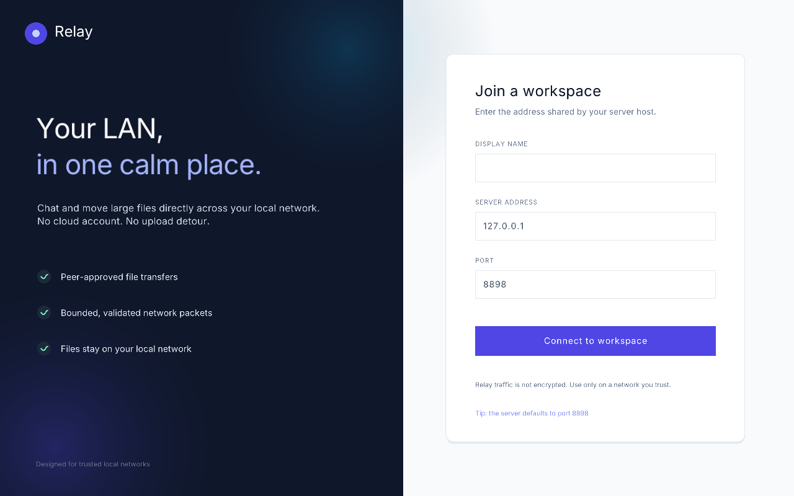

# Relay

Relay is a small desktop chat and file-transfer app for trusted local networks. A lightweight C server applies workspace policy over a typed v2 wire protocol; every invited participant independently approves or declines a file before bytes are delivered.



*Connect to a Relay server on your local network, then chat and transfer files from the desktop client.*

## What it does

- LAN chat with server-authored sender identities
- Drag-and-drop file transfer up to 500 MB per file
- Broadcast File Offers with independent accept/reject decisions
- Atomic Received Files: partial data stays hidden and is removed on failure
- Linux builds and Windows cross-builds from Linux
- Bounded packet sizes, queues, connection counts, and transfer slots

## Security model

Relay is intended for a **trusted LAN**. Traffic is not encrypted and there is no password or cryptographic peer authentication, so do not expose port `8898` to the public internet. The implementation rejects malformed or oversized typed messages, validates display names and metadata, uses server-assigned participant and offer identities, uses OS randomness for client correlation IDs, and sanitizes received filenames.

For use across an untrusted network, run Relay through a trusted VPN or add authenticated TLS before deployment.

## Build

The repository vendors raylib for 64-bit Linux and Windows. A C compiler and the normal Linux X11 development/runtime libraries are required.

```console
cc -o nob nob.c       # bootstrap once
./nob                 # build client and server
./nob test            # build and run the test suite
```

Run the apps in separate terminals:

```console
./nob server
./nob run
```

The server listens on all local interfaces at TCP port `8898`. The client defaults to `127.0.0.1:8898` and also accepts hostnames.

## Using Relay

1. Start `./nob server` on one machine in the LAN.
2. Start `./nob run` on each participant's machine.
3. Enter a display name and the server machine's LAN address, then connect.
4. Type a message and press Enter, or drag a regular file anywhere onto the client window.
5. Recipients choose whether to accept the file and where it should be saved.

Controls:

- `Enter` sends the current message.
- `Shift+Enter` inserts a line break.
- `F3` toggles the FPS diagnostic overlay.
- Closing the window safely stops queued sends and active transfers.

### Windows cross-build

Install a MinGW-w64 toolchain, then run:

```console
./nob win
```

The resulting `client_gui.exe`, `server.exe`, and runtime DLLs are placed in `build/`.

## Project layout

```text
src/client_gui.c       application loop and interface wiring
src/ui_components.c   raylib/raygui interface
src/client_network.c   opaque connection, delivery queue, and sender thread
src/file_transfer.c    File Offer, File Transfer, Delivery, and Received File lifecycle
src/protocol.c         shared typed v2 codec, framing, bounds, and validation
src/relay_policy.c     deterministic workspace and relay policy
src/server.c           nonblocking socket adapter for Relay policy
src/test/              interface-level Unity tests
```

Received files are stored in `received/` by default. That directory and generated build artifacts are intentionally ignored by Git.

## Verification

The test suite covers fragmented and coalesced frames, malformed-message rejection, frozen Recipient Sets, Offer Window expiry, independent Delivery failures, sender disconnects, atomic Received Files, partial cleanup, and backpressure retry. Run it before submitting changes:

```console
./nob test
```
